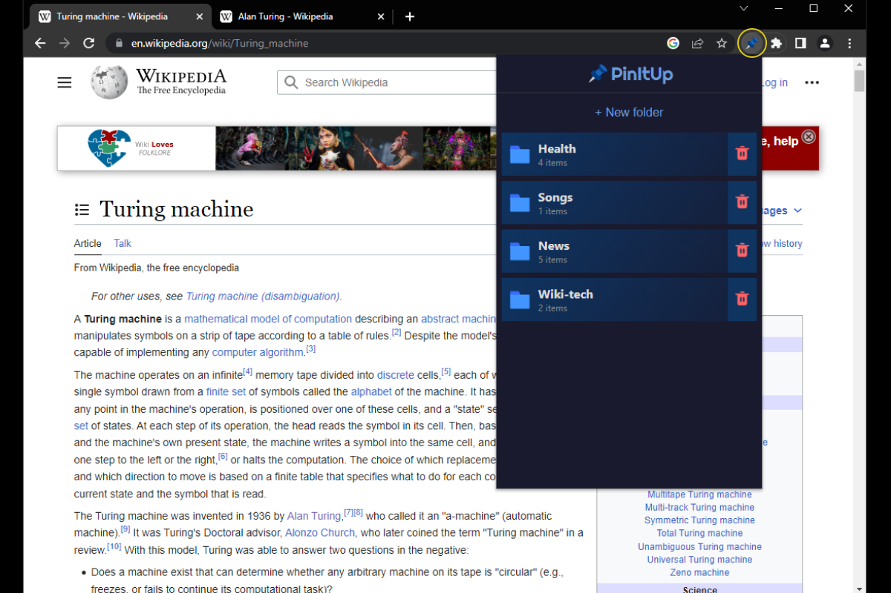
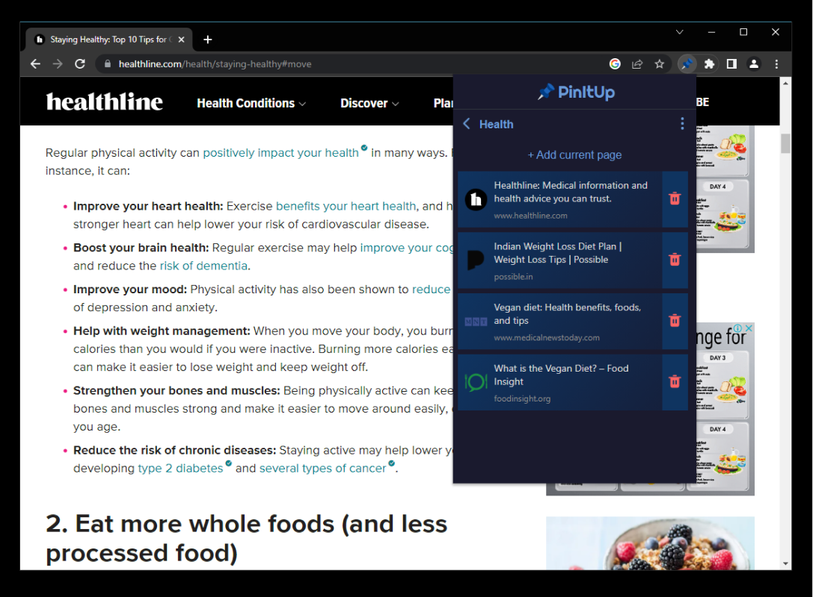
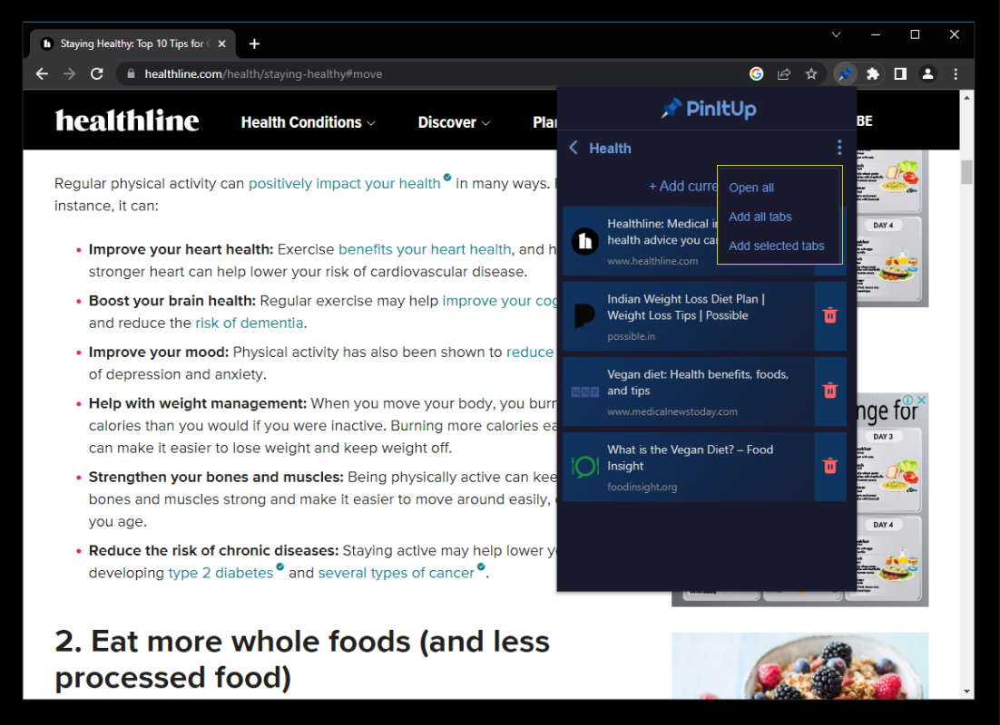

   

<h1 align="center">PinTtUp 📌</h1>
<h3 align="center"> Bookmark extension for chromium browsers. 
</h3>

    
    
    
    
   

  <a href="#about-the-project">About The Project</a> •
  <a href="#local-setup">Download</a>
  

   

   

   

## About The Project
PinItUp is a modern bookmarking extension that helps you organize your bookmarks all in one place with ease.

Features:
1. Intuitive user interface
2. Organize bookmarks into different folders
3. Bookmark all currently active tabs
4. Bookmark selected tabs
5. Open all tabs of a folder

## Install PinItUp
Download from [Chrome Web Store](https://chrome.google.com/webstore/detail/pinitup/bdlikbaegahppphbllkecmegphbaodnm)

